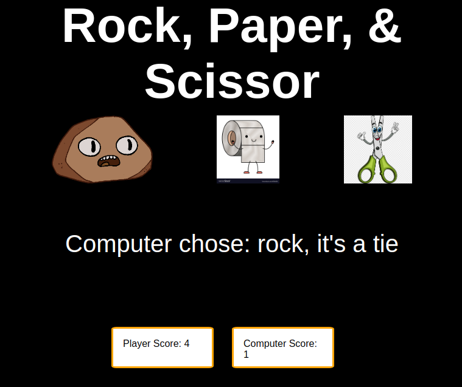

# Rock Paper Scissors
This is a simple rock, paper and scissor game. The user plays against the computer (Here the computer play is generated randomly out of the three options). One game is of five rounds and on each round the results are displayed. In the end, the app displays if the user won or lost. 
 
Link: https://ruchik03.github.io/rock-paper-scissor/
 
 
 
